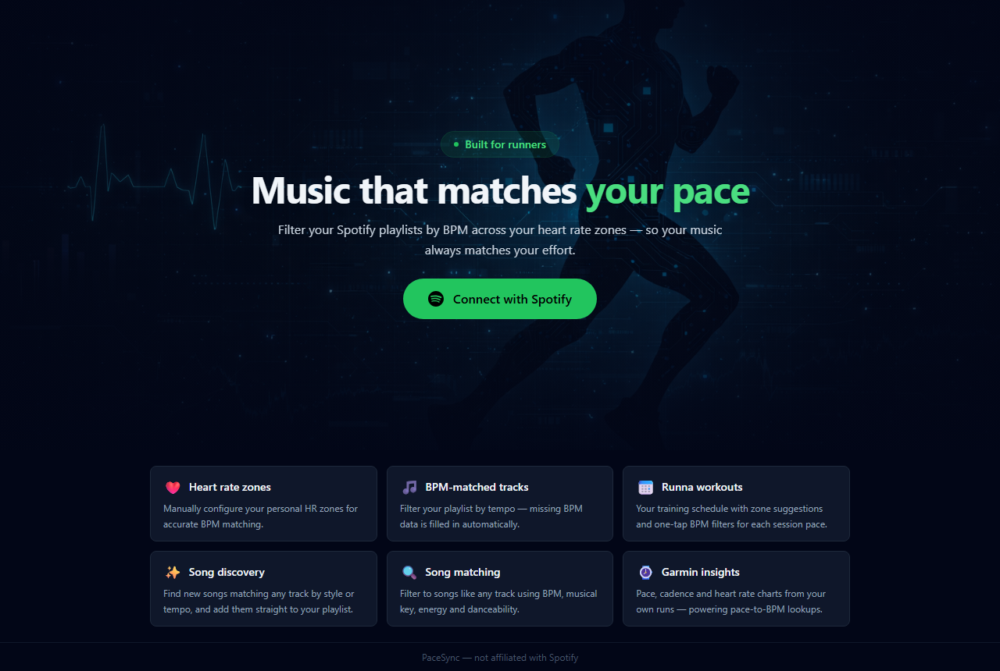
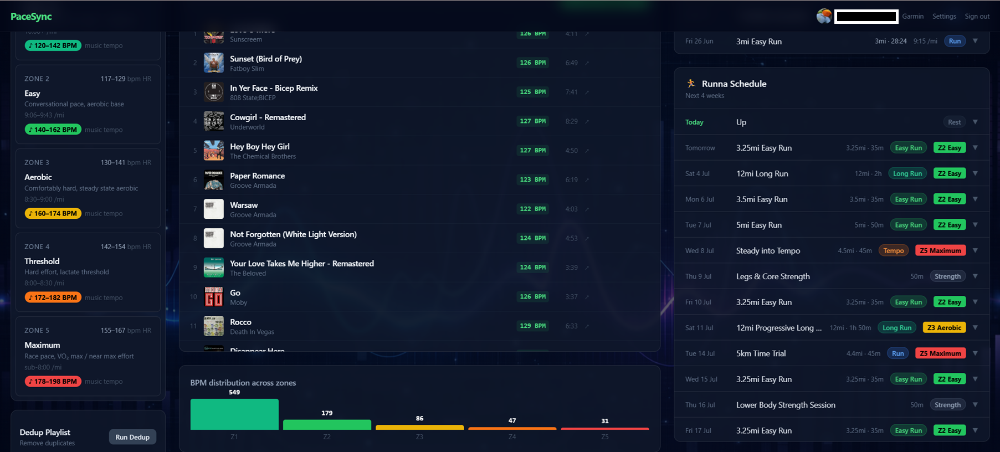
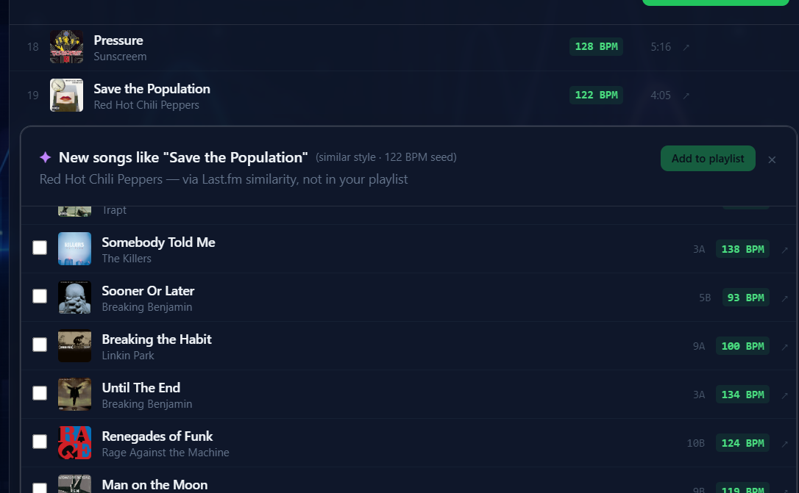
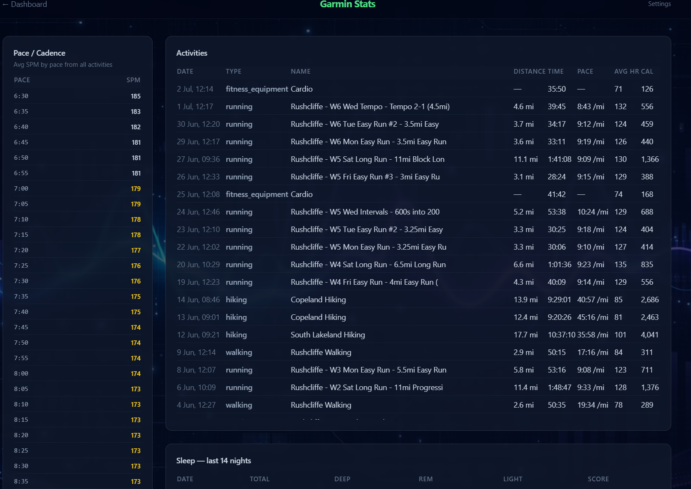

# PaceSync — Running Playlist Manager

A Next.js web app for managing a Spotify running playlist based on heart rate zones. Runs as a self-hosted service on a Raspberry Pi.



**Features**
- Browse tracks by BPM / heart rate zone (Z1–Z5)
- Add tracks from BBC Radio playlists directly to Spotify — with BPM data fetched automatically
- Click any track to play it **instantly on your active Spotify device** (falls back to opening the app/web player if nothing's active)
- Delete tracks from Spotify and local CSV simultaneously
- Import and auto-save your Exportify CSV export
- Runna training calendar integration with zone suggestions and per-pace BPM filter buttons (driven by your real Garmin cadence data)
- **Song matching**: filter the playlist to songs similar to any track (BPM, musical key, energy)
- **Song suggestions**: discover new tracks *not* in your playlist that match a seed track by style or tempo (via Last.fm / Deezer / ReccoBeats), and add them to the playlist with one click
- **Automatic BPM enrichment**: tracks without BPM data are looked up on ReccoBeats automatically
- **🎧 AI DJ Mix** (optional): build a pace-matched playlist for any Runna workout — each section's tempo and intensity track your target pace, with an optional local LLM for smarter track choices. Powered by the [AI_DJ companion app](https://github.com/niblarto/AI_DJ). See [AI DJ Mix](#ai-dj-mix-optional) below
- Dedup playlist, to remove duplicate tracks
- Garmin activity stats: pace/cadence/HR charts and activity summaries, read directly from a local [GarminDB](https://github.com/tcgoetz/GarminDB) database
- Weekly cron job to keep the playlist fresh:-
    - Pull down the tracks of the last show, for the BBC programmes that are currently subcribed to
    - Upload to the Spotify "Running" playlist, then dedupe the "Running" playlist.

---

## Prerequisites

- Pi OS / Debian
- Python 3 with `paramiko` installed on your **local machine** (for deployment)
- A [Spotify Developer](https://developer.spotify.com/dashboard) app
- Your running playlist exported from Spotify using [Exportify](https://exportify.net) as a CSV with BPM data

---

## 1. Spotify App Setup

1. Go to [Spotify Developer Dashboard](https://developer.spotify.com/dashboard) and create an app.
2. Note the **Client ID** and **Client Secret**.
3. Under **Redirect URIs**, add:
   ```
   https://your-domain.com/api/auth/callback/spotify
   ```
   (or `http://localhost:3000/api/auth/callback/spotify` for local dev)

---

## 2. Configure Environment Variables

```bash
cp .env.example .env.local
```

Edit `.env.local` and fill in all required values:

| Variable | Required | Description |
|---|---|---|
| `SPOTIFY_CLIENT_ID` | ✅ | From Spotify Developer Dashboard |
| `SPOTIFY_CLIENT_SECRET` | ✅ | From Spotify Developer Dashboard |
| `NEXTAUTH_SECRET` | ✅ | Random string: `openssl rand -base64 32` |
| `NEXTAUTH_URL` | ✅ | Your public URL, e.g. `https://your-domain.com` (or `http://localhost:3000` for local dev) |
| `CRON_SECRET` | ✅ | Random string: `openssl rand -hex 24` — protects the cron endpoint |
| `NEXT_PUBLIC_RUNNING_PLAYLIST_ID` | ✅ | Your Spotify running playlist ID |
| `RUNNA_ICS_URL` | optional | Your Runna calendar ICS URL — can also be set in **Settings → Runna Integration** after deploy |
| `NTFY_TOPIC` | optional | Your ntfy.sh topic name for push notifications — can also be set in **Settings → Push Notifications** after deploy |
| `LASTFM_API_KEY` | optional | [Last.fm API key](https://www.last.fm/api/account/create) for song suggestions. Without it, discovery falls back to Deezer related artists (works, but finds fewer new tracks) |
| `GARMINDB_SYNC_WRAPPER` | optional | Path to the GarminDB sync wrapper script (see [GarminDB Integration](#garmindb-integration)) — only needed for the Settings sync-status card |
| `GARMINDB_PYTHON_BIN` | optional | Path to the Python binary inside your GarminDB venv |
| `GARMINDB_LOG_PATH` | optional | Path to the GarminDB sync log file |

To find your **playlist ID**: open the playlist on [open.spotify.com](https://open.spotify.com), copy the URL — the ID is the string after `/playlist/`.

> **Settings page overrides**: `RUNNA_ICS_URL` and `NTFY_TOPIC` can be left blank here and configured directly in the app after deploying. Values saved via Settings take precedence over `.env.local`.

---

## 3. Configure Deployment Target

```bash
cp deploy_config.example.py deploy_config.py
```

Edit `deploy_config.py` with your Pi's details:

```python
PI = {
    'host': '192.168.0.x',   # Pi's local IP address
    'port': 22,
    'user': 'pi',             # SSH username
    'password': 'your_pi_password',
}

PORT      = 5005
PI_REMOTE = '/home/pi/running-playlist'
```

> `deploy_config.py` is gitignored — it will never be committed.

---

## 4. Deploy to Raspberry Pi

Install the deploy dependency on your local machine if needed:

```bash
pip install paramiko
```

Then run:

```bash
python deploy.py
```

This will:
1. Upload all source files to the Pi over SSH/SFTP
2. Run `npm install` and `npm run build` on the Pi
3. Install and start a `systemd` service (`running-playlist`)
4. Set up a weekly cron job (Fridays at 14:00) to refresh the playlist

The app will be available at `http://<pi-ip>:5005`.

---

## 5. Export Your Spotify Playlist with Exportify

PaceSync needs your Spotify playlist as a CSV file with BPM data. Exportify is a free tool that generates this.

1. Go to [exportify.net](https://exportify.net) and click **Log in with Spotify**.
2. Find your running playlist in the list and click **Export**.
3. Exportify downloads a `.csv` file containing all tracks with BPM, energy, and other audio features.

> **Note:** Exportify is used because Spotify's audio features API (which provides BPM data) is no longer accessible to newer personal developer accounts. Exportify uses a different access path to retrieve this data. (For tracks added later through the app — BBC cards, song suggestions — PaceSync fetches BPM automatically from ReccoBeats instead, so re-exports are rarely needed.)

---

## 6. Upload the CSV to PaceSync

1. Open the app and sign in with Spotify.
2. Go to **Settings**.
3. Under **Import Playlist**, click **Upload CSV** and select the file downloaded from Exportify.
4. The file is saved on the Pi as `Running.csv`.
5. Return to the **Dashboard** — your tracks will load automatically.

---

## 7. First-Time Setup in the Browser

1. Go to **Settings** → **Heart Rate Settings** and enter your max HR and resting HR to calculate your zones. Override individual zone boundaries if needed, then click **Save zones**.
2. (Optional) Connect Runna — see [Runna Integration](#runna-integration) below.
3. (Optional) Add BBC Radio programme cards from the dashboard to have tracks added to your Running playlist automatically each week.

---

## Playing Tracks



Click any track in the list to start it playing **immediately on your active Spotify device** — no window switching. This uses Spotify's Web Playback control API, which requires the `user-modify-playback-state` scope.

> **If you signed in before this feature was added**, sign out and back in once so Spotify re-issues your token with the new scope — otherwise playback silently falls back to opening the Spotify app/web player instead of playing instantly.

If there's no active Spotify device (nothing currently playing anywhere), it falls back to launching the desktop app via a `spotify:track:...` link, then opens the web player after a second if the app doesn't take focus.

---

## Zone Selection

Click any zone in the left column to filter tracks and build a playlist for that zone.

**Multi-zone selection:** Hold **Ctrl** (or **Cmd** on Mac) and click additional zones to combine them. Tracks from all selected zones are merged into a single list and the playlist name updates automatically — e.g. selecting Zone 1 and Zone 2 produces `Running – Z1Z2`, selecting Zone 2 and Zone 4 produces `Running – Z2Z4`.

Ctrl+clicking an already-selected zone removes it. Clicking any zone without Ctrl resets to a single-zone selection.

---

## BBC Radio Cards

PaceSync can pull tracks from BBC Radio programmes and add them directly to your Spotify running playlist.

**Setting up a BBC card:**

1. Go to the **Dashboard** and click **Add BBC Programme** (or the BBC browser card).
2. Click on a Station (e.g. Radio 2, Radio 6 Music)
3. Search for a BBC programme by name (e.g. "6 Music's 90s Forever", "Sarah Cox Breakfast Show").
4. Select the programme from the results — a card will appear on the dashboard showing the most recent episode's tracklist.
5. Click **Add to Spotify** on the card to add all tracks from that episode to your Running playlist immediately.

**Automatic weekly updates:**

Once a programme card is added, the weekly cron job (Fridays at 14:00) will automatically fetch the latest episode's tracks and add them to your playlist. You can also trigger this manually from **Settings** → **Run Now**.

**BPM data is fetched automatically.**

When you click **Update Running playlist** on a BBC card, PaceSync looks up each track's audio features (tempo, key, energy, danceability, valence) on [ReccoBeats](https://reccobeats.com) — a free, keyless API that accepts Spotify track IDs — and appends them to `Running.csv`. The status message shows how many tracks got BPM data (e.g. *"Added 12 tracks · 11 with BPM data"*), and they appear in zone/pace filters straight away.

The rare track ReccoBeats doesn't know stays BPM-less; see [Tracks without BPM data](#tracks-without-bpm-data) below for how to handle those.

---

## Song Matching & Suggestions



Hover over any track in the main list to reveal three action buttons (next to the delete icon):

### 🔽 Filter songs like this (green funnel)

Instantly re-filters the playlist to the ~30 tracks most similar to the one you clicked. Similarity is a weighted distance over BPM (half/double-time aware — 174 BPM matches 87 BPM tracks), Camelot-wheel key distance, energy, danceability and valence. The seed track stays at the top, ranked closest-first. Click any zone or pace button to clear the filter.

### ✦ Search new songs — similar style (purple sparkles)

Discovers tracks **not in your playlist** that feel like the seed track. Pipeline: Last.fm similar-tracks → Deezer resolves each candidate to an ISRC → ReccoBeats returns audio features. Candidates are ranked with style-weighted distance (energy/danceability/valence/key dominate; BPM only 15%).

### ♩ Search new songs — similar tempo (orange metronome)

Same discovery pipeline, but ranked with BPM at 70% of the weighting — results lock onto the seed's tempo. Use this to grow a specific pace zone.

**How suggestion results work:**

- Searches take **1–2 minutes** (external APIs with polite rate limiting). The clicked icon becomes a spinner and a card opens directly below the track showing live progress.
- Results appear with checkboxes. The row itself opens the track in the Spotify app (web player fallback) so you can preview before deciding.
- Select tracks and click **Add N to playlist** — they're added to your Spotify Running playlist *and* appended to `Running.csv` with full BPM data, so they immediately join the zone/pace filters.
- Results are cached until the app restarts, so re-running the same search is instant.

> The matcher lives in [`bpm_matcher/`](bpm_matcher/) (pure Python — pandas/numpy, installed on the Pi automatically by `deploy.py`). Run its tests with `pytest bpm_matcher/tests`. See [`bpm_matcher/HANDOFF.md`](bpm_matcher/HANDOFF.md) for API details, including why Spotify's own recommendation endpoints can't be used.

---

## Tracks without BPM data

The **All Songs** tile shows a count of tracks with no BPM info (red when non-zero).

- **On dashboard load**, PaceSync automatically tries to fill these in from ReccoBeats — found features are written back into `Running.csv` and the count drops on its own.
- **Click the count** to filter the main list to just those tracks. From there you can:
  - Click **Retry BPM lookup** to re-attempt the ReccoBeats lookup manually
  - Delete tracks that shouldn't be in the playlist (trash icon)
  - Or re-export the playlist from [exportify.net](https://exportify.net) and re-upload via **Settings → Import Playlist** for anything ReccoBeats doesn't know

---

## Runna Integration

PaceSync can pull your upcoming Runna workouts and display them on the dashboard with suggested heart rate zones.

If GarminDB is also configured, expanding a workout shows a **BPM filter button for each pace** in the session (e.g. `8:15 · 168 BPM`) — the BPM comes from *your own* average cadence at that pace, computed from Garmin per-second data. Clicking one filters the track list to that BPM ±2; **Ctrl+click** several to widen the range across paces. Workouts that only say "conversational pace" borrow the no-faster-than pace from your easy runs.

**Finding your iCal URL:**

1. Open the **Runna app** on your phone
2. Tap **Profile** → **Settings**
3. Tap **Calendar Integration**
4. Copy the **iCal / Webcal URL**

**Adding it to PaceSync:**

Go to **Settings** → **Runna Integration**, paste the URL, and click **Save URL**. The URL is stored on the Pi and takes effect immediately — no restart required.

> Keep the URL private. It provides read-only access to your training schedule.

Alternatively, you can set `RUNNA_ICS_URL` in `.env.local` before deploying — the app will use the settings page value if set, otherwise falls back to the environment variable.

---

## AI DJ Mix (optional)

Builds a pace-matched Spotify playlist for a Runna workout: each section of the run (warm up, tempo/interval reps, walking rest, cool down) is filled with tracks matched to that section's target BPM and intensity, timed to last as long as the section itself.

The mixing engine is **[AI_DJ](https://github.com/niblarto/AI_DJ)**, a companion app published separately — a natural-language DJ setlist builder with a dedicated workout mode. It runs as a small HTTP service that PaceSync calls; see its README for full installation, CLI usage (it can also build M3U playlists for Mixxx), and configuration.

**How the mix is built:**
- **Tempo** scales continuously with pace — each segment's pace is converted to a target BPM via your Garmin cadence data (falling back to a linear fit if GarminDB isn't configured), and tracks are filtered to that BPM band.
- **Intensity** (Spotify's energy feature) is bucketed by segment type: warm up 0.45–0.85, work (tempo/intervals) 0.60–1.00, walking rest 0.00–0.50, cool down 0.00–0.60 — so hard efforts pull driving, high-energy tracks and rest/cool-down periods pull calmer ones.
- Section changes land on track boundaries — the playlist doesn't cut a song off mid-way when the pace changes.

**Using it:**
1. Expand any runnable workout in the **Runna Schedule** card and click **🎧 AI DJ Mix**.
2. The mix builds (takes a few seconds to a minute, longer if the optional LLM is enabled) and populates the **central track list card** — it does *not* save to Spotify automatically.
3. From there:
   - **Save to Spotify** saves it under the pre-filled dated name (e.g. `08-07-26 Steady into Tempo`, editable).
   - **Save to Today's Running Playlist** saves the same tracks to a standing playlist named **"Today's Run"** (created on first use, overwritten each time).
   - Neither happens until you click one — review the tracklist first.
4. Click **🎧 Remix** to rebuild and refresh the central list with a different pick (e.g. after adding new tracks to your library).

**Daily automatic pre-build:** if enabled, a cron job runs at **15:30 Pi-local time** every day. If there's a runnable workout scheduled for *tomorrow*, it builds the mix and saves it straight to **"Today's Run"** on Spotify — no dated playlist, no manual step — then sends an ntfy push notification (success with track count, or a clear failure reason) if you have a topic configured. By the time you wake up for the run, "Today's Run" is already correct.

### Optional local LLM

Track selection within each section can happen two ways:

- **With an LLM** (default when available): the service calls a local [Ollama](https://ollama.com) model (`qwen2.5:7b` by default) with a mood-aware prompt per section (e.g. *"Hard effort — driving, motivating, relentless"* for work, *"Recovery — calm"* for rest) to pick and order tracks from the BPM/energy-filtered candidate pool.
- **Without an LLM**: tracks are chosen purely by [bpm_matcher](bpm_matcher/)'s weighted distance — a deterministic greedy nearest-neighbour chain over BPM, Camelot key, energy, danceability and valence. No GPU or model download needed; runs fine on a Raspberry Pi.

**The LLM is entirely optional and fails gracefully**, at two levels:

- If the service is reachable but **Ollama isn't** (not running, model not pulled, or started with `--no-llm`), the service falls back to the deterministic distance-chain per section — the mix still completes, just without the LLM's picks.
- If the **whole service is unreachable** (PC off or asleep), PaceSync builds the mix **on the Pi itself** using the same vendored workout mixer in no-LLM mode. As a bonus, the on-Pi fallback reads your real Garmin cadence data for exact pace→BPM matching (the remote service uses a linear approximation). Either way, the manual button and the 15:30 cron keep working.

**Setting it up:**

1. **Run the [AI_DJ](https://github.com/niblarto/AI_DJ) service** somewhere on your network (a PC with Ollama for LLM-assisted mixes, or the Pi itself with `--no-llm` for the deterministic-only mode — it's pure Python, no GPU required). Clone the repo and follow its README; PaceSync calls two of its endpoints:
   - `POST /mix` `{title, segments, csv, easyPace?, useLlm?}` → `{trackUris, totalSec, timeline}`
   - `GET /health` → `{ok, llm}`
2. If running with LLM support, install [Ollama](https://ollama.com/download) and pull a model: `ollama pull qwen2.5:7b` (or set a different model — see the [AI_DJ README](https://github.com/niblarto/AI_DJ#setup)).
3. If the service runs on a separate machine from the Pi, **allow inbound traffic on its port through the firewall** — and if using Windows, scope the rule to cover whatever network profile that connection uses (Private *and* Public), since Windows can silently reclassify a network and drop a Private-only rule.
4. In PaceSync, go to **Settings**, scroll to the bottom of the **middle column**, and find the **🎧 AI DJ** card:
   - Enter the service's URL (e.g. `http://192.168.1.50:8765`) and click **Save**.
   - A live connection indicator appears next to the URL field — green "Connected · LLM ready" (or "no LLM (distance-chain only)" if running with `--no-llm`), red with the failure reason if unreachable. It's checked automatically as you type and every 60 seconds while the page is open, and there's a refresh icon to re-check on demand.
   - Once a URL is saved, flip the **enable** toggle to start showing the AI DJ Mix button on Runna workouts.

> The `ai-dj-config.json` this creates on the Pi is gitignored, same as other personal settings files.

---

## GarminDB Integration



PaceSync's **Garmin** page (activity list, pace/cadence tables, per-lap speed segments) reads directly from a local SQLite database — it does not call the Garmin Connect API itself. That database is produced by [**GarminDB**](https://github.com/tcgoetz/GarminDB), a separate open-source tool by Tom Goetz that syncs your Garmin Connect data to SQLite.

Because PaceSync reads the SQLite file straight off disk (via `better-sqlite3`), **GarminDB must be installed on the same Pi/server that runs PaceSync** — there's no network sync between them, just a shared file.

### Install GarminDB on the Pi

SSH into the Pi and set up GarminDB in its own virtual environment:

```bash
python3 -m venv ~/garmindb-venv
~/garmindb-venv/bin/pip install garmindb
```

Create the config file with your Garmin Connect credentials:

```bash
mkdir -p ~/.GarminDb
cp ~/garmindb-venv/lib/python*/site-packages/garmindb/GarminConnectConfig.json.example \
   ~/.GarminDb/GarminConnectConfig.json
```

Edit `~/.GarminDb/GarminConnectConfig.json`:
- Set `credentials.user` / `credentials.password` to your Garmin Connect login.
- `data.download_all_activities` controls how many historical activities a full sync fetches (default `1000`).

Run the first full sync (this downloads your entire activity history and can take a while):

```bash
~/garmindb-venv/bin/python3 ~/garmindb-venv/bin/garmindb_cli.py --all --download --import --analyze
```

This creates the databases under `~/HealthData/DBs/`. PaceSync only needs **`garmin_activities.db`** from that folder.

### Point PaceSync at the database

1. In PaceSync, go to **Settings → Garmin** (or visit `/garmin` and follow the prompt if it's not configured yet).
2. Enter the full path to the database, e.g. `/home/pi/HealthData/DBs/garmin_activities.db`.
3. Save — the **Garmin** page will start showing your activities immediately.

### Keeping it in sync

Add a daily cron job on the Pi to pull new activities (`--latest` only fetches recent ones, so it stays fast):

```bash
crontab -e
```

```
0 15 * * * /home/pi/garmindb-venv/bin/python3 /home/pi/garmindb-venv/bin/garmindb_cli.py --all --download --import --analyze --latest
```

> **Sync status card:** Settings also shows a live sync status card with a log tail and a "Sync now" button. This launches GarminDB through a small wrapper script that timestamps each log line (so tqdm progress bars can be parsed) and reads back from a fixed log path. If you want that card to work, write a timestamping wrapper around `garmindb_cli.py` on the Pi (it just needs to prefix each output line with a time and write to a log file) and set `GARMINDB_SYNC_WRAPPER`, `GARMINDB_PYTHON_BIN`, and `GARMINDB_LOG_PATH` in `.env.local` to match your paths. Without it, you can still sync GarminDB manually via cron/SSH — only the status card's live log and "Sync now" button won't work.

### Notes

- GarminDB occasionally fails to download a FIT file for an activity that Garmin Connect only stores as GPX (no FIT archived) — those activities won't have per-second speed/cadence data, which is a Garmin Connect limitation, not a PaceSync or GarminDB bug.
- If an activity fails to import with an `UnknownEnumValue` error on `hr_zones_method`, that's a known GarminDB parsing edge case for certain FIT files — the rest of the sync still completes normally.
- The intial data pull from Garmin to the local database can take hours, the transfer is throttled so that excessive data grab thresholds are not breached, leading to 429 errors

---

## Push Notifications (ntfy.sh)

PaceSync can send push notifications to your phone when the weekly playlist update runs, using [ntfy.sh](https://ntfy.sh) — a free, open source notification service.

**Setting up ntfy.sh:**

1. Install the **ntfy app** on your phone:
   - [iOS — App Store](https://apps.apple.com/app/ntfy/id1625396347)
   - [Android — Play Store / F-Droid](https://ntfy.sh/docs/subscribe/phone/)
2. In the ntfy app, tap **+** and subscribe to a topic — choose any name you like, e.g. `my_running_playlist_abc123`. Topic names are public, so use something unique and hard to guess.
3. In PaceSync, go to **Settings** → **Push Notifications** and enter the same topic name, then click **Save topic**.

Alternatively, set `NTFY_TOPIC` in `.env.local` before deploying — the Settings page value takes precedence if set.

**What you'll receive:**

- A notification when the weekly update starts, listing the BBC programmes being processed
- A per-programme notification with how many tracks were found and added
- A final summary with total tracks added and deduplication results
- Error notifications (with high priority) if anything goes wrong

---

## Updating

After making code changes, redeploy with:

```bash
python deploy.py
```

Your `Running.csv` on the Pi will not be overwritten.

---

## Raspberry Pi Service Management

```bash
# Check status
systemctl status running-playlist

# View live logs
journalctl -u running-playlist -f

# Restart
sudo systemctl restart running-playlist
```

---

## Local Development

```bash
npm install
npm run dev
```

App runs at `http://localhost:3000`. You will need to add `http://localhost:3000/api/auth/callback/spotify` as a redirect URI in your Spotify app.
